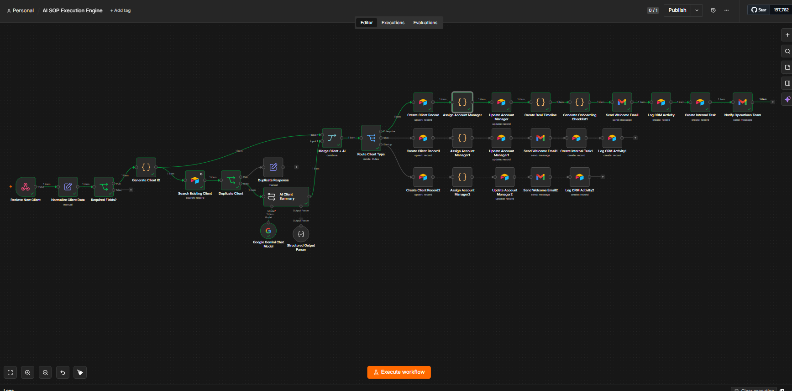
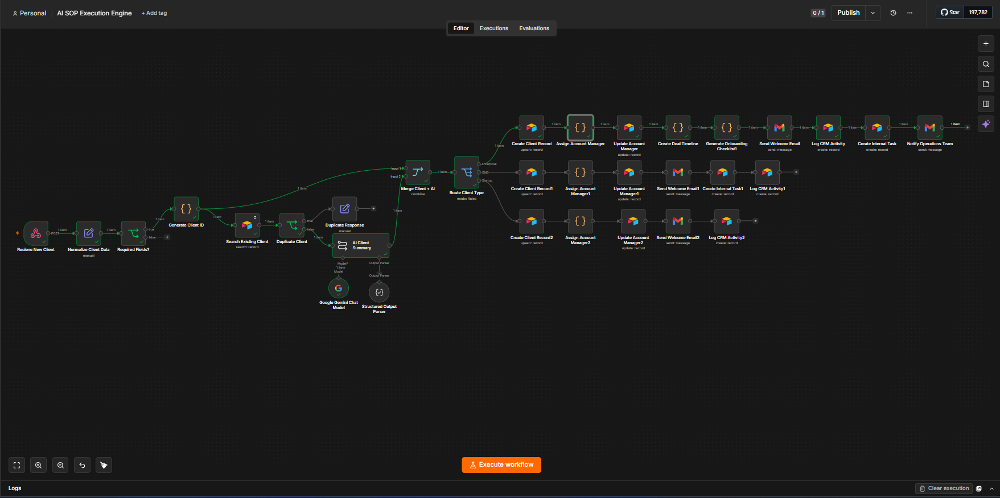
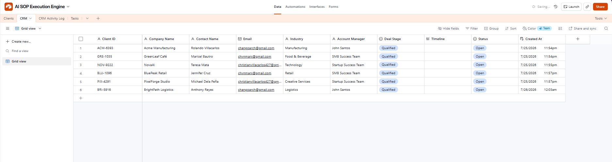
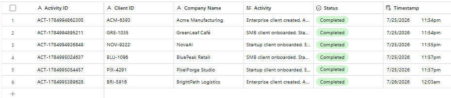
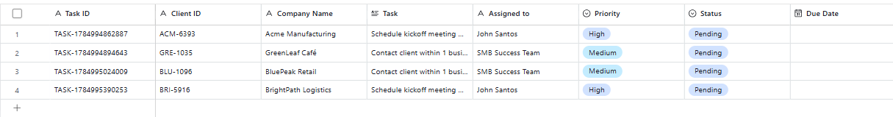

# AI SOP Execution Engine

An AI-powered workflow automation system that executes a company's Standard Operating Procedures (SOPs) after a new client is signed.

Instead of manually coordinating multiple departments, a single event triggers an automated workflow that validates client information, detects duplicate records, generates an AI-powered operational summary, routes clients based on their onboarding requirements, and executes the appropriate onboarding process.

---
## Workflow Overview




## Workflow Execution

The workflow executes a complete onboarding process based on the client's type. Each execution validates the client, performs AI-assisted analysis, routes the request, updates the CRM, and completes the corresponding onboarding workflow automatically.



---
## Project Overview

This project demonstrates how businesses can automate client onboarding using n8n, Google Gemini, Airtable, and Gmail.

The workflow begins when a new client enters the system. It validates incoming information, generates a unique client ID, checks for existing records, creates an AI-powered client summary, and routes the client into different onboarding workflows based on their business type.

Each client type follows its own Standard Operating Procedure (SOP), allowing Enterprise, SMB, and Startup clients to receive onboarding experiences tailored to their operational requirements.

---

## Workflow Capabilities

- Receive new client data through a webhook
- Normalize incoming client information
- Validate required fields
- Generate unique client IDs
- Detect duplicate clients using Airtable
- Generate AI-powered client summaries using Google Gemini
- Route clients based on client type (Enterprise, SMB, Startup)
- Automatically create CRM records
- Assign account managers
- Generate onboarding timelines (Enterprise)
- Generate onboarding checklists (Enterprise)
- Send automated welcome emails
- Create internal onboarding tasks
- Log CRM activities
- Notify the operations team (Enterprise)

---
## CRM Database

Client records are automatically created and updated throughout the onboarding process. The CRM stores client information, assigned account managers, deal status, and onboarding progress.



## CRM Activity Log

Every onboarding workflow creates an activity record to provide an auditable history of important actions performed during execution.



## Internal Tasks

The workflow automatically generates internal tasks based on the onboarding process, assigning them to the appropriate account manager with the corresponding priority level.


---
## Workflow Overview

```
Receive New Client
        │
        ▼
Normalize Client Data
        │
        ▼
Required Fields Validation
        │
        ▼
Generate Client ID
        │
        ▼
Duplicate Detection
        │
   ┌────┴────┐
   │         │
Duplicate   Continue
 Response      │
               ▼
      AI Client Summary
               │
               ▼
      Route Client Type
      ┌──────┼────────┐
      │      │        │
Enterprise   SMB   Startup
```

---

## Tech Stack

| Component | Technology |
|----------|------------|
| Workflow Automation | n8n |
| Database | Airtable |
| AI | Google Gemini |
| Email Service | Gmail |
| Trigger | Webhook |
| Version Control | GitHub |

---

## Repository Structure

```
docs/
    architecture.md
    workflow-breakdown.md
    airtable-schema.md
    setup-guide.md

workflow/
    ai-sop-execution-engine-v1.json
```

---

## Documentation

Additional documentation is available in the `docs` folder.

- Architecture
- Workflow Breakdown
- Airtable Schema
- Setup Guide

---

## Project Status

**Version:** v1.0

The initial version of the AI SOP Execution Engine has been completed.

Current implementation includes:

- Client intake automation
- AI-assisted client assessment
- Dynamic onboarding workflow routing
- Enterprise onboarding workflow
- SMB onboarding workflow
- Startup onboarding workflow
- CRM automation
- Email notifications
- Internal task generation
- Activity logging

Future enhancements may expand the workflow to additional business functions such as Finance, IT, Reporting, and post-onboarding automation.

---

## Purpose

I built this project to strengthen my workflow automation and operations skills by designing a business process that reflects how organizations automate client onboarding at scale.

Rather than creating isolated automations, I wanted to build a workflow that combines AI, business rules, CRM automation, and operational processes into a single end-to-end onboarding system.
